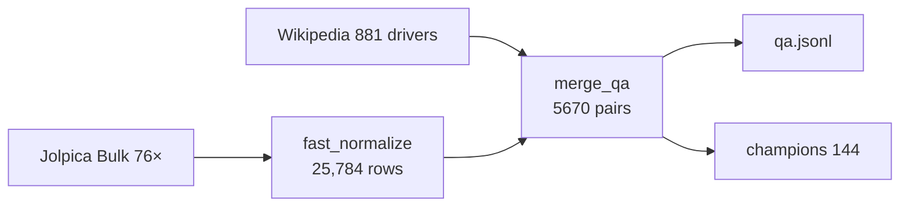

# F1-Dataset 1950-2025

LLM Q&A finetuning dataset — 1149 races, 25,784 results, 5670 QA pairs.

## Sources
- **Jolpica F1 API** (`api.jolpi.ca/ergast/f1`) — 76 seasons bulk `/{season}/{results,qualifying,driverStandings,constructorStandings}.json` (CC BY-SA)
- **Wikipedia** (`wikipedia-api`) — 881 drivers, 76 seasons, 16 incidents, 11 constructors

## Data
```
data/raw/jolpica/          76 bulk _results.json + _schedule.json (104M)
data/raw/wikipedia/        drivers_wiki.json (14M) seasons_wiki.json (4.1M)
data/processed/races_normalized.jsonl  25,784 rows, 1149 races
data/processed/champions.json          144 (76 drivers + 68 constructors)
data/final/qa.jsonl                    5670 pairs {question,answer,source,entity_type,season}
```

## QA schema
`question` paraphrased (3x per race), `answer` factual, `source` traceable `Jolpica:season/round/results` or `Wikipedia:Page`, `entity_type` race_result|season_champion|driver_bio|incident|season_summary, `season` int.

## Architecture



## Usage
```python
from datasets import load_dataset
ds = load_dataset("json", data_files="data/final/qa.jsonl")
```

## Reproduce
```bash
pip install requests wikipedia-api
python pipeline/01_fetch_jolpica_bulk.py  # 0.6s polite, offset+=100 paginated, validates races==sched
python pipeline/fast_normalize.py         # dedup (race_id,driverId) → 25784
python pipeline/03_merge_qa.py
```

## Coverage
1950-2025 **100% races (1149/1149)**, 76/76 seasons, 881/881 drivers, results only, no telemetry/laps/weather.

## License
Data CC BY-SA 4.0 (Jolpica/Wikipedia), code MIT. See `data/processed/DATA_DICTIONARY.json`.

## Author

**Vinesh**

Built with ❤️

